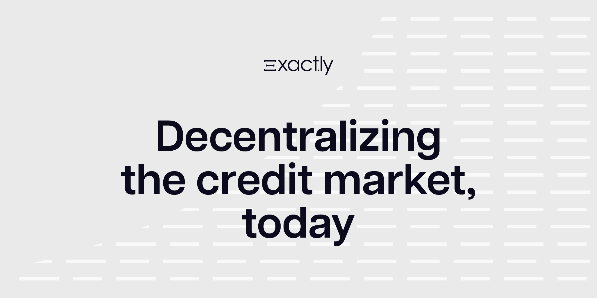

# 🔔 Welcome

<figure><figcaption>
Hero logo - Decentralizing the credit market, today
</figcaption></figure>

Welcome! Here you will find our white and math papers, guides on using our Protocol to lend and borrow crypto assets, and all the material developers will need to start building on top of Exactly.

[Exactly Protocol](https://exact.ly/) was started in July 2021, launched to [Ethereum Mainnet](https://app.exact.ly/?n=mainnet) in November 2022, and to [Optimism](https://app.exact.ly/?n=optimism) in March 2023 by a team of stakeholders with expertise in technology, economics, finance, and math. You can find more info about us on [Linkedin](https://linkedin.com/company/exactly-protocol) and [GitHub](https://github.com/exactly).

Exactly was funded by long-term capital partners with a track record of alignment with Web2 and Web3 ecosystems. Some of our current investors are [Kazsek](https://www.kaszek.com/), [BairesDAO](https://twitter.com/bairesdao), [6thManVentures](https://www.6thman.ventures/), [NXTP](https://www.nxtp.vc/), [Newtopia](https://newtopia.vc/), [Kain Warwick](https://twitter.com/kaiynne) (Co-Founder of [Synthetix](https://synthetix.io/)), [Esteban Ordano](https://twitter.com/eordano) (Co-Founder of [Decentraland](https://decentraland.org/)), [Matias Woloski](https://twitter.com/woloski) (Co-Founder of [Auth0](https://auth0.com/)), [Daedalus](https://www.daedalus.gg/) among others.

The Protocol was audited by Coinspect, Chainsafe, and ABDK, among others. The economic model was audited by Cryptecon. You can find all the audit reports [here](https://docs.exact.ly/security/audits).

Follow us on [Discord](https://discord.gg/nFKzxNvz), [Telegram](https://t.me/exactlyFinance), and [Twitter](https://twitter.com/exactly\_finance) for our updates.
