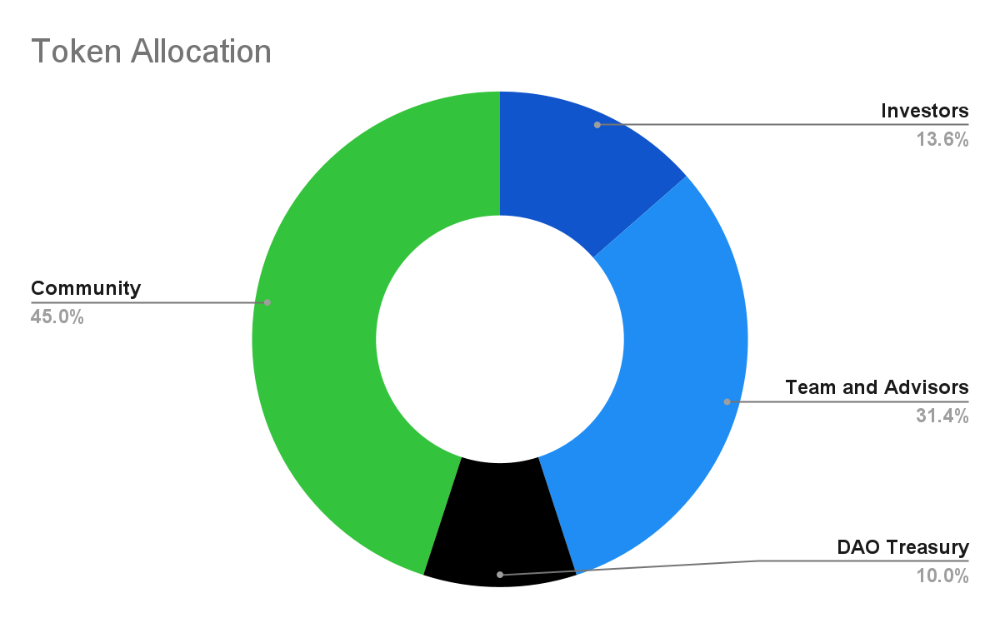

# 🔢 Parameters

There is an explanation of the following parameters in [Model Parameters](../getting-started/math-paper.md#model-parameters).

## A. Reserve Factor

$$
\begin{align*} \eta = 10\% \end{align*}
$$

$$\eta$$ is the fraction of the total [Variable Rate Pool](https://docs.exact.ly/getting-started/math-paper#3.-variable-rate-pool) supply selected as Liquidity Reserve.

## B. Treasury Fee

$$
\begin{align*} \lambda_r = 0\% \end{align*}
$$

The treasury fee refers to the percentage of interest rate charges paid by borrowers that the protocol retains for its treasury.

## C. Interest Rate Curves

|                     | WETH        | DAI         | USDC        | WBTC        | wstETH      | OP          |
| ------------------- | ----------- | ----------- | ----------- | ----------- | ----------- | ----------- |
| Variable Rate Pools |             |             |             |             |             |             |
| $$A$$ =             | 1.9362e-2   | 1.7852e-2   | 1.4844e-2   | 3.6184e-2   | 1.9362e-2   | 2.8487e-2   |
| $$B$$ =             | -1.787e-3   | -2.789e-3   | 1.9964e-4   | -1.5925e-2  | -1.787e-3   | -5.8259e-3  |
| $$U_{max}$$=        | 1.003870947 | 1.003568501 | 1.002968978 | 1.007213882 | 1.003870947 | 1.005690787 |
| Fixed Rate Pools    |             |             |             |             |             |             |
| $$A$$=              | 3.8126e-1   | 3.9281e-1   | 3.9281e-1   | 3.697e-1    | 3.8126e-1   | 3.5815e-1   |
| $$B$$=              | -3.6375e-1  | -3.7781e-1  | -3.7781e-1  | -3.497e-1   | -3.6375e-1  | -3.3564e-1  |
| $$U_{max}$$=        | 1.000010695 | 1.000014451 | 1.000014451 | 1.000007768 | 1.000010695 | 1.000005527 |

These parameters are utilized to calculate [the effective borrow interest rate](https://docs.exact.ly/getting-started/math-paper#4.1.2-the-effective-interest-rate-for-a-particular-loan).

## D. Risk Factors

|                     | WETH   | DAI    | USDC   | WBTC   | wstETH | OP     |
| ------------------- | ------ | ------ | ------ | ------ | ------ | ------ |
| $$ho$$(borrow/lend) | 0.8400 | 0.9000 | 0.9100 | 0.8500 | 0.8200 | 0.3500 |

We associate a [Risk-Adjust Factor](https://docs.exact.ly/getting-started/math-paper#6.-liquidations) to each asset to assess each collateral asset's borrow and lending power.

To assess the Risk-Adjust Factor for each asset in the protocol, you can query the `markets()` function on the [Auditor](protocol/auditor.md) contract. This can be done using [Etherscan](https://etherscan.io/), a blockchain explorer.

Follow the steps below to check the Risk-Adjust Factor for a specific asset:

1. Go to the Auditor contract on Etherscan by navigating to the following URL: [https://etherscan.io/address/0x310A2694521f75C7B2b64b5937C16CE65C3EFE01#readProxyContract#F17](https://etherscan.io/address/0x310A2694521f75C7B2b64b5937C16CE65C3EFE01#readProxyContract#F17) (for other networks go to [smart-contract-addresses.md](smart-contract-addresses.md "mention") and click on the address of the desired Auditor contract)
2. To query the `markets` function in that contract, you will need the market contract address for the specific asset. For example, you can use the following address to check the Risk-Adjust Factor for USDC: `0x660e2fC185a9fFE722aF253329CEaAD4C9F6F928`. All addresses for each network (Mainnet, Optimism, et al) are available in [smart-contract-addresses.md](smart-contract-addresses.md "mention").
3. Click the "Query" button to call the function. The result will display various information about the market, including the Risk-Adjust Factor.
4. The Risk-Adjust Factor will be returned as `adjustFactor`. In this case, `910000000000000000` equals to 0.91.\
   

Following these steps, you can check the Risk-Adjust Factor for any asset in the protocol by simply replacing the market contract address with the one corresponding to the desired asset.

## E. Variable Rate Pool Fee

$$
\begin{align*} \delta = 10\% \end{align*}
$$

$$\delta$$ is the fraction of the [fixed interest rate fees](https://docs.exact.ly/getting-started/math-paper#4.2.1-supply-interest-rate) retained by the Variable Rate Pool upon leaving the Fixed Rate Pool.

## F. Supply E.M.A. Parameters

$$
\begin{align*} \beta_{slow} = 0.0046 \end{align*}
$$

The time decay parameter is used when the supply is above average.

$$
\begin{align*} \beta_{fast} = 0.4000 \end{align*}
$$

The time decay parameter is used when the supply is below average.

## G. Target Solvency Ratio

$$
\begin{align*} \Gamma = 1.25 \end{align*}
$$

Target solvency ratio after [liquidation](https://docs.exact.ly/getting-started/math-paper#6.-liquidations).

## H. Liquidation Bonuses

$$
\begin{align*} \nu_{liquidator} = 5.00\% \\ \nu_{bad-debt} = 0.25\% \end{align*}
$$

During the [liquidation process](https://docs.exact.ly/getting-started/math-paper#6.-liquidations), the liquidator gets a commission fee, and the Variable Rate Pool receives a percentage of extra liquidation fees to compensate for potential bad debt residuals.

## I. Extraordinary Earnings Distribution Factor

$$
\begin{align*} \xi_{extearn} = 2.00 \end{align*}
$$

## J. Penalty Rate

$$
\begin{align*} PenaltyRate = 0.45\% \end{align*}
$$

The penalty rate fee is charged to fixed interest rate borrowers who didn't pay their loans on time. This fee is charged daily after the maturity day.
