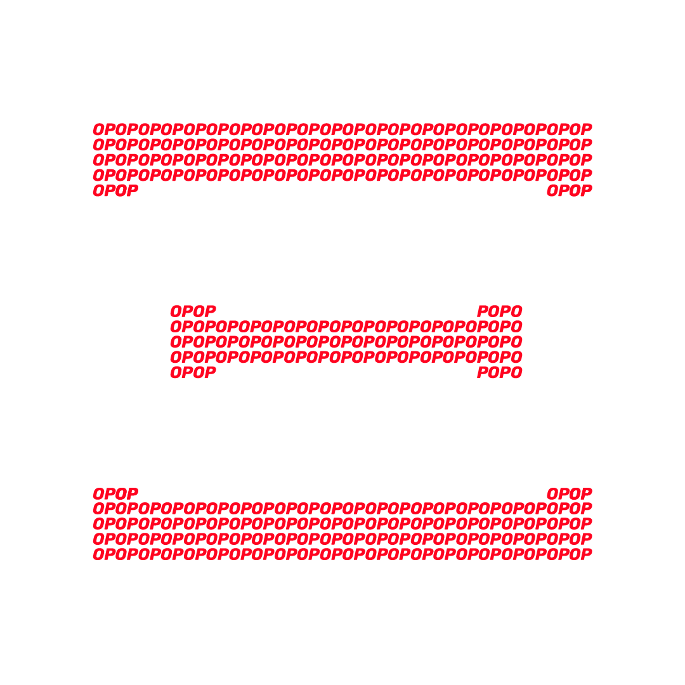

# 📣 Brand Assets

## Wordmarks

## Isologos

## Social

<figure><figcaption>
Twitter logo ASCII version with mathematical formulas of our Math Paper
</figcaption></figure>

<figure><figcaption>
Twitter logo ASCII Optimism version
</figcaption></figure>

